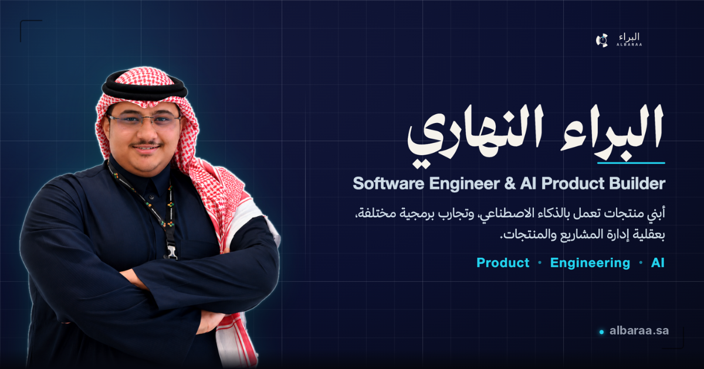

# Albaraa Alnahari Space

### مساحة البراء النهاري

A bilingual personal portfolio and digital space for Albaraa Alnahari — showcasing software engineering, AI products, projects, resume, and technical impact.


---



---

## Links

- **Live site:** https://albaraa.sa
- **Repository:** https://github.com/AlbaraaAlnahari/Personal-Portfolio

## Overview

**Albaraa Alnahari Space** is the personal portfolio and digital home of Albaraa Alnahari. It brings together selected projects, professional experience, a resume, measurable impact, contact channels, and an interactive **Ask Albaraa AI** page into a single, cohesive space.

The site is fully bilingual — **Arabic (RTL)** and **English (LTR)** — with a premium, editorial/technical visual system. It is **theme-aware** (a deep **Navy** default and a **Warm** alternative), responsive across mobile and desktop, accessibility-conscious, and built to be deployment-ready. The interface is organized around an internal design concept nicknamed _ALBARAA OS_ — an editorial command-deck language — though the public identity is simply _Albaraa Alnahari Space_.

## Features

- **Bilingual Arabic / English** experience with full RTL/LTR support and a language toggle
- **Theme-aware interface** — Navy (default) and Warm themes; the choice persists in `localStorage` with no flash of the wrong theme
- **Responsive** layouts tuned for mobile through desktop
- **Project showcase** presenting real, shipped work
- **Resume interface** with an in-page PDF preview and download
- **Impact section** with metrics and leadership / community highlights
- **Contact form** backed by a server-side API (validation, spam honeypot, rate limiting)
- **Ask Albaraa AI** — an interactive Q&A page that answers from a curated knowledge base about Albaraa's work (Arabic answers in Arabic, English answers in English)
- **SEO essentials** — localized metadata, Open Graph + Twitter cards, JSON-LD structured data, theme-aware favicons, and a web manifest
- **Accessibility & motion** — keyboard focus states, labeled forms, image alt text, and `prefers-reduced-motion` support

## Tech stack

Confirmed from `package.json`:

- **Next.js 15** (App Router)
- **React 19**
- **TypeScript 5**
- **Tailwind CSS v4**
- **Framer Motion 11** — animation and motion system
- **React Three Fiber + drei + three.js** — the 3D "intelligence engine" hero visual
- **Resend** — transactional email for the contact form
- **lucide-react** — icon set
- **clsx + tailwind-merge** — className composition utilities
- **ESLint + Prettier** — linting and formatting
- **Vercel** — deployment target

## Project structure

```
.
├── app/                     # Next.js App Router — routes, layouts, metadata
│   ├── api/contact/         # Contact form endpoint (Resend email delivery)
│   ├── about/ work/ impact/ resume/ contact/ ask/   # Page routes
│   ├── layout.tsx           # Root layout, metadata, theme/language bootstrap
│   ├── apple-icon.tsx       # Generated apple-touch-icon
│   └── manifest.ts          # Web app manifest
├── components/              # UI — navigation, page sections, layout, environment
├── lib/
│   ├── i18n/                # Bilingual dictionaries + SEO metadata builders
│   └── albaraa-knowledge.ts # Knowledge base for the Ask Albaraa AI page
├── styles/
│   └── globals.css          # Design tokens + Navy/Warm theme system
├── public/                  # Static assets — favicons, images, OG image, resume PDF
└── ARCHITECTURE.md          # Design-system & metadata notes
```

## Getting started

Requires Node.js 18.17+ and npm.

```bash
# Install dependencies
npm install

# Start the dev server
npm run dev

# Production build
npm run build

# Run the production server
npm start
```

The dev server runs at **http://localhost:3000**.

## Environment variables

A `.env.local` file is only required for production-like **contact form** behavior (sending email). The rest of the site runs without it. Use placeholders locally — never commit real values (`.env.local` is gitignored):

```bash
RESEND_API_KEY=
CONTACT_TO_EMAIL=
CONTACT_FROM_EMAIL=
```

- **`RESEND_API_KEY`** — your [Resend](https://resend.com) API key; required for email delivery.
- **`CONTACT_TO_EMAIL`** — the inbox that receives contact-form submissions.
- **`CONTACT_FROM_EMAIL`** — the verified sender address (typically a domain email once your domain is set up in Resend).

Without these set, the contact endpoint responds gracefully with a "not configured" message instead of sending.

## Deployment

Designed to deploy on **Vercel**:

1. Connect the GitHub repository to a Vercel project (Next.js is auto-detected).
2. Set the environment variables (`RESEND_API_KEY`, `CONTACT_TO_EMAIL`, `CONTACT_FROM_EMAIL`) in the Vercel project settings.
3. Add the custom domain **albaraa.sa**.
4. Verify DNS and SSL for the domain in Vercel.
5. Deploy.

## Quality checks

Before shipping, run:

```bash
npx tsc --noEmit          # type check
npm run build             # production build
npm run lint              # ESLint (runs `next lint --fix`; use `npx eslint .` for a read-only check)
npm audit --audit-level=high
```

The project was reviewed during final QA for responsive behavior, accessibility basics, metadata / Open Graph, and security sanity, with **no high or critical `npm audit` issues** at the time of QA. These are point-in-time checks, not permanent guarantees — re-run them as the code evolves.

## Contact

- **Website:** https://albaraa.sa
- **Email:** albaraa.a.alnahari@gmail.com
- **LinkedIn:** https://www.linkedin.com/in/albaraa-alnahari
- **GitHub:** https://github.com/AlbaraaAlnahari

## Status

**Pre-launch — deployment-ready.**

## License

Declared as **MIT** in `package.json`. A standalone `LICENSE` file has not been added to the repository yet — add one to make the MIT terms explicit.
